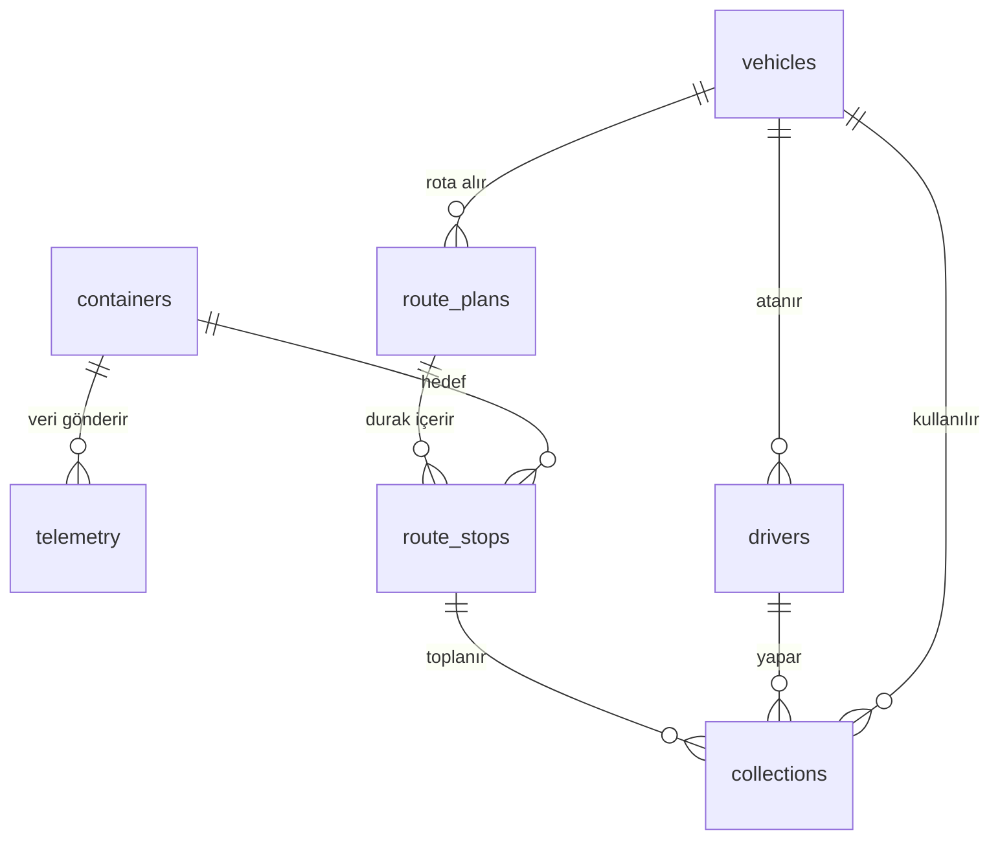

# 🗄️ Atık Yönetimi Veritabanı (PostgreSQL)

Bu proje, akıllı atık toplama sistemine ait veritabanı tasarımını içermektedir. Sistem; konteynerlerden gelen doluluk verilerini işleyerek rota planlama ve toplama süreçlerini yönetmek amacıyla geliştirilmiştir. Veritabanı PostgreSQL kullanılarak ilişkisel bir yapı üzerinde tasarlanmış ve veri bütünlüğü, performans ve sürdürülebilirlik ön planda tutulmuştur.

---

# 🎯 Sistem Mantığı

Sistem şu akışla çalışır:

1. Konteynerler doluluk verisi gönderir (**telemetry**)
2. En güncel durum hesaplanır (**latest_container_state**)
3. %60 üzeri dolu konteynerler seçilir
4. Araçlara rota atanır (**route_plans, route_stops**)
5. Toplama işlemleri kaydedilir (**collections**)

---

# 🧱 Veritabanı Yapısı

## Ana Tablolar

* **containers** → Konteyner bilgileri
* **telemetry** → Sensör verileri (zaman serisi)
* **vehicles** → Araçlar
* **drivers** → Sürücüler (login sistemi)
* **route_plans** → Rota planları
* **route_stops** → Rotadaki duraklar
* **collections** → Toplama işlemleri

---

# 🔗 ER Diyagram (Şema)



---

# ⚡ View (Kritik Bileşen)

## latest_container_state

Her konteynerin en güncel doluluk bilgisini verir.

📌 Amaç:

* Tüm telemetry verisini taramamak
* Performansı artırmak
* Rota planlamayı optimize etmek

---

# 🔒 Veri Bütünlüğü

Veritabanında veri güvenliği için:

* **Foreign Key** → tablolar arası ilişki
* **Constraint** → veri doğrulama
* **ENUM** → sabit değer kontrolü
* **UNIQUE** → tekrar kayıt engelleme

---

# 🚫 Duplicate (Çift Kayıt) Önleme

`collections` tablosunda:

```sql
idempotency_key UNIQUE
```

Bu sayede aynı toplama işlemi birden fazla kez kaydedilemez.

---

# 🧠 Mimari Yapı

```text
Konteyner → Telemetry → View (latest state)
          ↓
      Rota Planlama
          ↓
   route_plans → route_stops
          ↓
      Toplama (collections)
```

---

# ⚙️ Kurulum

## Docker ile PostgreSQL başlatma

```bash
docker run --name atik-postgres \
-e POSTGRES_USER=postgres \
-e POSTGRES_PASSWORD=123456 \
-e POSTGRES_DB=atik_yonetimi \
-p 5432:5432 \
-d postgres:16
```

---

## Veritabanını yükleme

```bash
docker exec -i atik-postgres psql -U postgres -d atik_yonetimi < database/atik_yonetimi_dump.sql
```

---

# 🧪 Test Örnekleri

```sql
SELECT * FROM vehicles;
SELECT * FROM drivers;
SELECT * FROM latest_container_state;
```

---

# 🎯 Tasarım Kararları

* Normalize edilmiş yapı kullanıldı
* Telemetry verisi ayrı tutuldu
* View ile performans optimize edildi
* Foreign key ile veri bütünlüğü sağlandı
* Constraint ile hatalı veri engellendi
* Idempotency ile duplicate önlendi

---

# 📎 Veritabanı Dosyası

📁 `database/atik_yonetimi_dump.sql`

Bu dosya ile sistem tamamen yeniden kurulabilir. 

---

# 🚀 Sonuç

Bu veritabanı:

✔️ Gerçek dünya modeline uygun
✔️ Performanslı
✔️ Güvenilir
✔️ Backend ile uyumlu
✔️ Ölçeklenebilir

---
