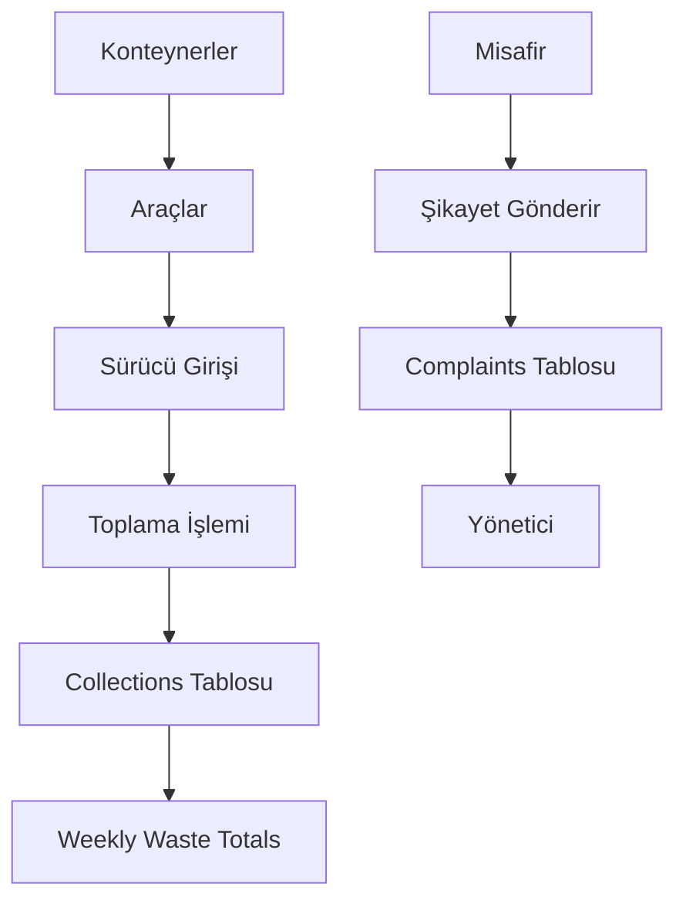
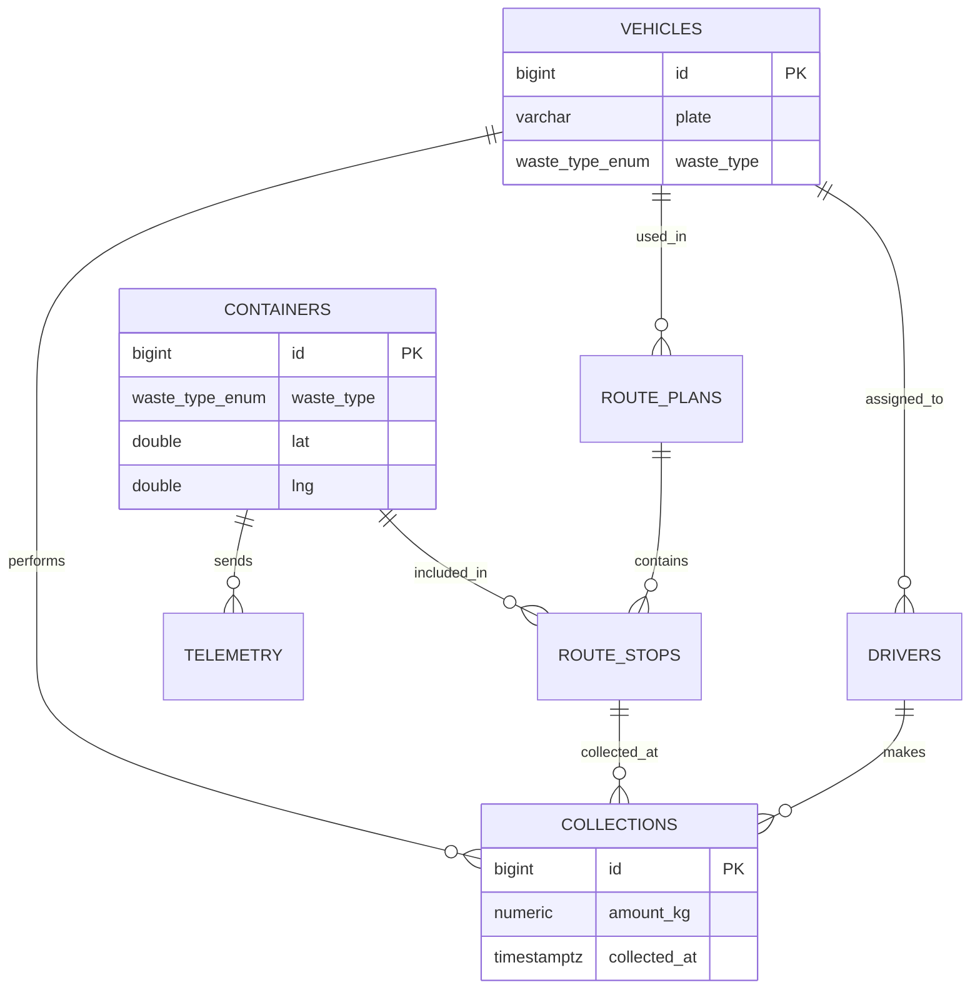

# ♻️ Akıllı Atık Yönetimi Veritabanı

Bu klasör, Akıllı Atık Yönetimi projesinin PostgreSQL veritabanını içerir.

Sistem; konteynerler, araçlar, sürücüler, rota planları, atık toplama işlemleri, şikayetler ve haftalık atık takibini yönetmek için tasarlanmıştır.

---

## 🎯 Projenin Amacı

Bu sistemin amacı:

- Atık konteynerlerini takip etmek  
- Araçlarla toplama işlemlerini yönetmek  
- Haftalık atık analizini yapmak  
- Kullanıcı ve yönetici etkileşimini sağlamak  

---

## ⚙️ Sistem Akışı



---

## 🧱 ER Diyagramı



---

## 🛠️ Kullanılan Teknolojiler

- PostgreSQL  
- Docker  
- SQL  
- Git & GitHub  

---

## 🚀 Kurulum

```bash
createdb -U postgres atik_yonetimi
psql -U postgres -d atik_yonetimi < database/atik_yonetimi.sql
```

Docker:

```bash
docker exec -i atik-postgres psql -U postgres -d atik_yonetimi < database/atik_yonetimi.sql
```

---

## 🗑️ Atık Türleri

- CAM  
- PLASTIK  
- KAGIT  
- IKINCI_EL_ESYA  
- METAL  

---

## 🚛 Araçlar

- Toplam: **10 araç**
- Her kategoride: **2 araç**

Giriş sistemi:

```sql
SELECT id, plate
FROM vehicles
WHERE plate = '01ABC001'
AND login_password = 'plastik02pass';
```

---

## 📍 Konteynerler

- Toplam: **75 konteyner**
- Her kategoride: **15 adet**
- **15 farklı lokasyon**

Her lokasyonda:

✔️ 5 farklı atık türü

---

## 📡 Telemetry

Konteynerlerden gelen:

- Doluluk  
- Pil seviyesi  
- Zaman bilgisi  

---

## 🔄 Toplama Sistemi

Toplama işlemleri `collections` tablosunda tutulur.

✔️ kg bilgisi  
✔️ GPS konumu  
✔️ sürücü & araç ilişkisi  

---

## 🧠 Haftalık Atık Takibi

`weekly_waste_totals` tablosu:

- Haftalık kg hesaplar  
- Otomatik güncellenir  

Reset:

```sql
SELECT reset_weekly_waste_totals();
```

---

## 🧾 Şikayet Sistemi

Misafir → Şikayet gönderir  
→ `complaints` tablosuna kaydedilir  

Yönetici:

- Görür  
- Siler  

---

## 👨‍💼 Yönetici Yetkileri

- Araç ekleme  
- Araç silme  
- Şikayet yönetimi  
- Veri izleme  

---

## 🔗 Veri İlişkileri

- drivers → vehicles  
- telemetry → containers  
- collections → vehicles  

---

## 🛡️ Constraint Kuralları

- Negatif kg yasak  
- Plate UNIQUE  
- DONE → amount zorunlu  
- SKIPPED → reason zorunlu  

---

## ⚡ Sistem Özeti

| Özellik | Değer |
|--------|------|
| Atık Türü | 5 |
| Araç | 10 |
| Konteyner | 75 |
| Lokasyon | 15 |

---

## ⚠️ Not

Bu proje eğitim amaçlıdır.

Gerçek sistemde:

- Şifreler hashlenmelidir  
- Yetkilendirme eklenmelidir  
- Cron job ile otomasyon yapılmalıdır  

---
